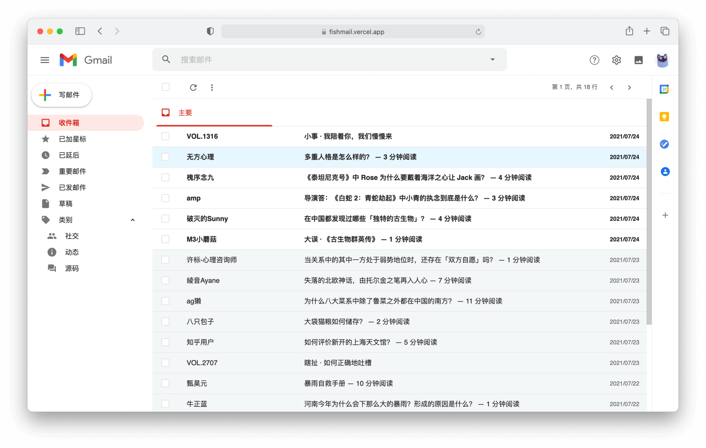

# Fishmail

奇怪的摸鱼工具增加了：装作在 Gmail 上查邮件的样子看知乎摸鱼，从而降低我上班摸鱼时的不安全感。

[Vue.js](https://vuejs.org) + [Nuxt.js](https://nuxtjs.org) + [Ant Design](https://antdv.com)

你看得出来有什么问题吗，不你看不出来：




&nbsp;

## Usage

```bash
# install dependencies
yarn install

# serve with hot reload at localhost:3000
yarn dev

# generate static project
yarn generate
```
